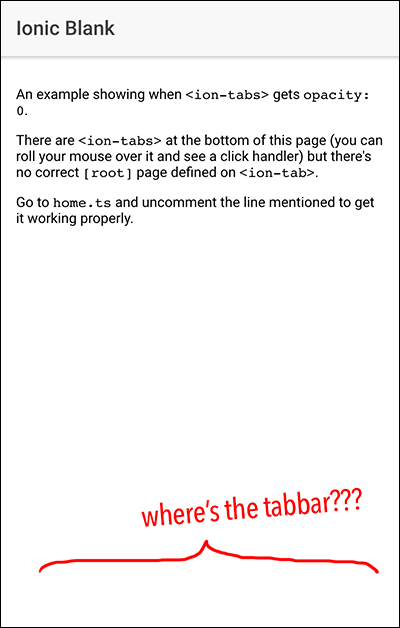

# Ionic .tabbar opacity 0

Clone it and run `ionic serve`. This example shows the error at `HomePage`.

There's also working tests on branches `one-tab` and `two-tabs`.

To get it working on this `master` branch, just uncomment this line on `home.ts`:

    // tab1 = Tab1Page // UNCOMMENT THIS LINE TO GET IT WORKING

**Explanation:** When there's no correct variable attributed to `<ion-tab>` `[root]` attribute, `.tabbar` gets `opacity: 0`. PS.: that's not exactly a bug.

